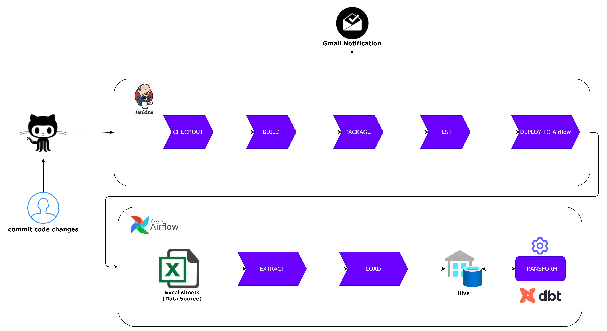

# The End-To-End Data Pipeline using Jenkins and Airflow

# Overview

A comprehensive ELT (Extract, Load, Transformation) project using Apache Spark, Apache Hive and DBT. This project includes a CI/CD pipeline implemented with Jenkins for automated build and deployment. The workflow orchestration of the ELT job is handled by Apache Airflow, enabling the scheduling and monitoring of ELT job. DBT is used to transform and prepare data for analysis in a data warehouse which is Hive in our case. The project showcases the integration of Spark, Hive and DBT for efficient data processing and storage, ensuring seamless data pipeline operations.

# ****The End-To-End Data Pipeline****



# **Built With**

1. I have used Ubuntu includes installations of the following

| language/tool | version |
| --- | --- |
| Scala | 2.12.10 |
| Python | 3.8.10 |
| Maven | 3.6.3 |
| Apache Airflow | 2.5.1 |
| Jenkins | 2.332.3 |
| dbt | 1.3.4 |
| dbt-hive plugin | 1.3.1 |
2. I have used a Hadoop cluster consisting of one NameNode and three DataNodes built using Docker. The cluster includes installations of the following

| language/tool | version |
| --- | --- |
| Apache Hadoop | 3.0.0 |
| Apache Hive | 3.1.2 |
| Apache Spark | 2.4.7 |

# Jenkins Pipeline

The pipeline contains the following stages:

- Checkout stage
- Build stage
- Generate JAR stage
- Deploy to Airflow Stage
- Post Actions Stage (Gmail Notification)


1. In Jenkins, create a pipeline `spark-hive-elt-cicd` and configure it to check the source code from GitHub repository which contains the jenkinsfile. 


2. You can trigger the pipeline manually or using GitHub hook trigger that listen for code changes and trigger the pipeline.


3. I used Email notification plugin to send me email either on success or on failure to track the status of my pipeline.


# Airflow Pipeline

The Airflow pipeline contains the following tasks:

- Extract from Excel file that contains multiple sheets
- Load data into hive
- Transform the data using Data Build Tool(DBT)


1. After deploying the ELT JAR and airflow Dag, then you will find that Dag is added and its tasks are scheduled to be run. 


2. Before loading the data into Hive, The data warehouse  is empty.


3. After loading the data into Hive.


## ELT

Here is a data for a dashboard of the SQL Saturday sessions from around the world from [data.world](http://data.world). You can access it via [https://data.world/stretcharm/sqlsaturday](https://data.world/stretcharm/sqlsaturday).

I have used Apache spark to read these sheets and load it into Hive using [spark-excel](https://mvnrepository.com/artifact/com.crealytics/spark-excel) library.

## DBT

DBT here is used to transform data in hive using models 

1. To connect to Hive, Use the following `profiles.yml`

```bash
dbt_with_hive:
  target: dev
  outputs:
    dev:
      type: hive
      host: master
      port: 10000 # Which is hive server port
      schema: default
```

> Hive server is up and running on port 10000
> 
2. The first simple model `events_2019.sql` , Filter events of year 2019
    
    
    
3. After loading the data into Hive the DBT job will be run and execute the models and save them inside the data warehouse.


# TO DO

- Dashboard to visualize data.
- Add data tests in DBT.

# **Acknowledgments**

- [Getting Started With Jenkins-Installation and Setup | by Abhishek Jain | Tech Insider | Medium | Tech Insider](https://medium.com/tech-insider/jenkins-installation-and-setup-from-scratch-on-linux-5d9746b11fce)
- [Install Apache Airflow the first time | by Kin Lau | Medium](https://medium.com/@madtopcoder/install-apache-airflow-the-first-time-97e7eef76469)
- [Install DBT (Data Build Tool). Steps to install DBT | by Ravi Kishore Reddy Lakkireddy | Medium](https://medium.com/@databotzero/install-dbt-data-build-tool-4cb425a43f8)
- [Apache Hive setup | dbt Developer Hub (getdbt.com)](https://docs.getdbt.com/docs/core/connect-data-platform/hive-setup)
- [Sign in with app passwords - Google Account Help](https://support.google.com/accounts/answer/185833), To generate app password for email notification in Jenkins